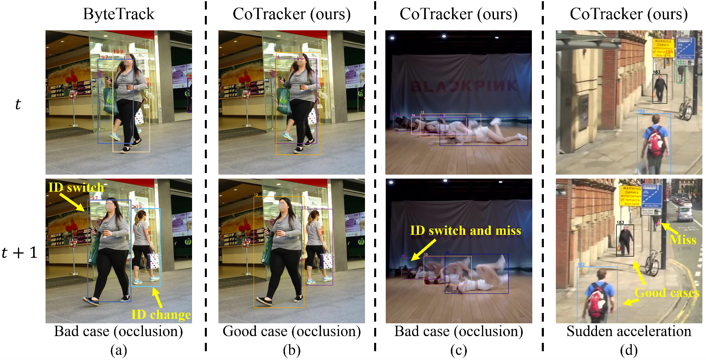

# ColTrack

#### ColTrack not only outperforms state-of-the-art methods on large-scale datasets under high frame rates but also achieves higher and more stable performance under low frame rates. This allows it to obtain a higher equivalent FPS by reducing the frame rate requirement.

<p align="center"></p>

> [**ColTrack: Collaborative Tracking Learning for Frame-Rate-Insensitive Multi-Object Tracking**](https://arxiv.org/abs/2308.05911)
> 
> [Yiheng Liu](https://yolomax.com/), Junta Wu, Yi Fu
> 
> *[arXiv:2308.05911](https://arxiv.org/abs/2308.05911)*


## News
* (2023.07) Our paper is accepted by ICCV 2023!

## Tracking performance
| Dataset    |  HOTA | MOTA | IDF1 |
|------------|-------|------|------|
|MOT17       | 61.0 | 78.8 | 73.9 | 
|Dancetrack  | 72.6 | 92.1 | 74.0 | 
|Dancetrack(+val)  | 75.3 | 92.2 | 77.3 | 

### Visualization results on MOT challenge test set
<p align="center"></p>

## Installation

The codebase is built on top of [DINO](https://github.com/IDEA-Research/DINO) and [MOTR](https://github.com/megvii-research/MOTR).

### Requirements

* Install pytorch using conda (optional)

    ```bash
    conda create -n coltrack python=3.9
    conda activate coltrack
    conda install pytorch==1.12.1 torchvision==0.13.1 torchaudio==0.12.1 cudatoolkit=11.3 -c pytorch
    ```

* Other requirements
    ```bash
    pip install Cython
    pip install -r requirements.txt
    ```

* Compiling CUDA operators
    ```bash
    cd models/dino/ops
   python setup.py build install
   # unit test (should see all checking is True)
   python test.py
   cd ../../..
    ```

## Data preparation

Download [MOT17](https://motchallenge.net/), [CrowdHuman](https://www.crowdhuman.org/), [DanceTrack](https://dancetrack.github.io/) and unzip them under `Coltrack_HOME` as follows:

```
mot_files
   |——————dataset
   |        └——————dancetrack
   |                  └—————test
   |                  └—————train
   |                  └—————val
   |        └——————MOT17
   |                  └—————images
   |                          └—————train
   |                          └—————test
   └——————models
   |         └——————coltrack
   |                    └——————dancetrack_val.pth
   |         └——————dino
   |         └——————dino_e2e

```

## Model zoo

### Ablation model

* **Standard models**

    Put these models in the directory `mot_files/models/coltrack`.

    | Model    | HOTA |  MOTA | IDF1 |
    |------------|-------|------|------|
    |[dancetrack_val](https://drive.google.com/drive/folders/1Z7jMp1UzjGF0Ck9mc6W_vpnRRk4xHVPs?usp=sharing)|73.51|92.1|76.48|

* **Dependency models**

     These models are downloaded from [DINO](https://github.com/IDEA-Research/DINO/tree/main)

    | Model    | Target folder  |
    |------------|-------|
    |[checkpoint0027_5scale_swin](https://drive.google.com/drive/folders/1qD5m1NmK0kjE5hh-G17XUX751WsEG-h_)|mot_files/models/dino|
    |[checkpoint0029_4scale_swin](https://drive.google.com/drive/folders/1qD5m1NmK0kjE5hh-G17XUX751WsEG-h_)|mot_files/models/dino|
    |[checkpoint0031_5scale](https://drive.google.com/drive/folders/1qD5m1NmK0kjE5hh-G17XUX751WsEG-h_)|mot_files/models/dino|
    |[checkpoint0033_4scale](https://drive.google.com/drive/folders/1qD5m1NmK0kjE5hh-G17XUX751WsEG-h_)|mot_files/models/dino|

## Training

Pretraining (Baseline model): This model is used to initialize the end-to-end model for the next stage.

```shell
cd <Coltrack_HOME>
bash scripts/train_dancetrack_val_tbd.sh your_log_folder_name
```

E2E model training: Select one model from the previous stage and put it in `mot_files/models/dino_e2e/4scale_ablation_res_dancetrack.pth`.

```shell
cd <Coltrack_HOME>
bash scripts/train_dancetrack_val_coltrack.sh your_log_folder_name
```

## Tracking

```shell
cd <Coltrack_HOME>
bash scripts/test_dancetrack_val_coltrack.sh your_log_folder_name

# logs/your_log_folder_name/ColTrack/track_results: The tracking results of ColTrack.
# logs/your_log_folder_name/IPTrack/track_results : interpolated tracking results of ColTrack, which may be better or worse. The interpolation algorithm is motlib/tracker/interpolation/gsi.py
```

## Demo for videos

```shell
cd <Coltrack_HOME>
# your_videos_path
#    |——————videos1.mp4
#    |——————videos2.mp4
bash scripts/demo.sh --output_dir your_log_folder_name --infer_data_path your_videos_path --is_mp4 --draw_tracking_results --inference_sampler_interval 1 --resume mot_files/models/coltrack/dancetrack_val.pth --options config_file=config/E2E/coltrack_inference.py
```

`--inference_sampler_interval 3` : The downsampling interval of the video frames.

## Demo for video frames

```shell
cd <Coltrack_HOME>

# your_video_frames_path
#    |——————videos1
#    |         └—————frame1.xxx
#    |         └—————frame2.xxx
#    |——————videos2
#    |         └—————xxx.xxx
#    |         └—————xxx.xxx

bash scripts/demo.sh --output_dir your_log_folder_name --infer_data_path your_video_frames_path --draw_tracking_results --inference_sampler_interval 1 --resume mot_files/models/coltrack/dancetrack_val.pth --options config_file=config/E2E/coltrack_inference.py
```

## Citation

```
@article{liu2023collaborative,
  title={Collaborative Tracking Learning for Frame-Rate-Insensitive Multi-Object Tracking},
  author={Liu, Yiheng and Wu, Junta and Fu, Yi},
  booktitle={ICCV},
  year={2023}
}
```

## Acknowledgement

A large part of the code is borrowed from [DINO](https://github.com/IDEA-Research/DINO), [MOTR](https://github.com/megvii-research/MOTR), [ByteTrack](https://github.com/ifzhang/ByteTrack) and [Bot-SORT](https://github.com/NirAharon/BoT-SORT). Many thanks for their wonderful works.